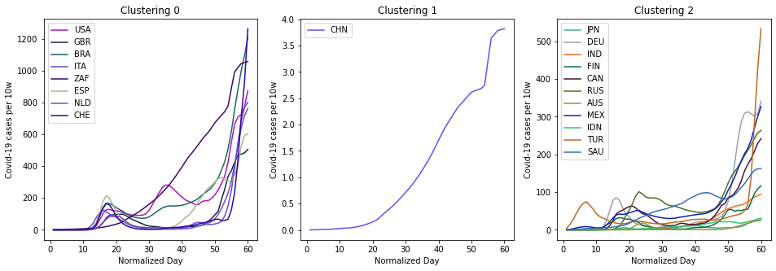

# GeoData-Analysis-Mining


**The code of GeoData-A&M course**


## Homework 1
Clustering(K-Means) and Regression(RNN).

Dataset: [2020 Covid-19 Cases Data](https://www.ecdc.europa.eu/en/publications-data/download-todays-data-geographic-distribution-covid-19-cases-worldwide)

**Dependence:**
```
numpy pytorch sklearn matplotlib pandas
```
**How to use:**

Run all cells in ./hw1/hw1.ipynb

**Clustering Result:**

<<<<<<< HEAD


---
## Homework 2
Classify(KNN & Decision tree).

Dataset: []()

**Dependence:**
```
sklearn
```
**How to use:**

Run all cells in ./hw2/hw2.ipynb
=======

>>>>>>> b9c16fb5e81ca0b17eaf8cf1bc0835e89c6a81b7
