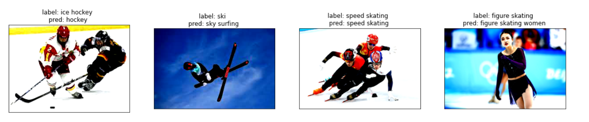

# GeoData-Analysis-Mining


**The code of GeoData-A&M course**


## Homework 1
Clustering(K-Means) and Regression(RNN).

Dataset: [2020 Covid-19 Cases Data](https://www.ecdc.europa.eu/en/publications-data/download-todays-data-geographic-distribution-covid-19-cases-worldwide)

**Dependence:**
```
numpy pytorch sklearn matplotlib pandas
```
**How to use:**

Run all cells in ./hw1/hw1.ipynb

**Clustering Result:**


## Homework 2

Classify(KNN & CNN).

Dataset: [100 Sports Image Classification](https://www.kaggle.com/gpiosenka/sports-classification)

**Dependence:**

```
numpy pytorch sklearn matplotlib pandas PIL torchvision
```

**How to use:**

* Download the dataset, and move it to folder dataset
* Run all cells in ./hw2/hw2.ipynb

**CNN  Classify Result:**



